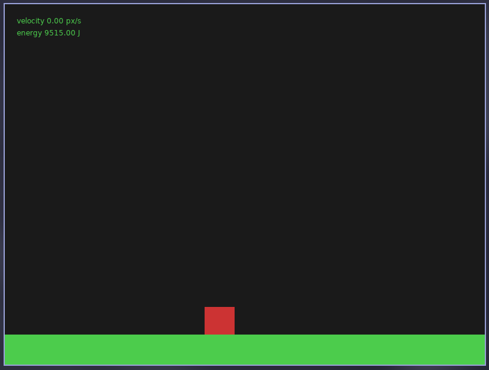

<div align="center">


<br/>


<br/>


# Physics

### *A simple 2D engine for physics simulations, exploring concepts like gravity, collisions, and motion.*


<!-- 
[**Live Demo**](https://fevunge.github.io/live-demo) &nbsp;·&nbsp;
[**Documentation**](https://fevunge.github.io/repo-name-placeholder/) &nbsp;·&nbsp;
[**Article**](https://github.com/fevunge/article-placeholder) &nbsp;·&nbsp;
-->
</div>

---

## Table of Contents

- [Overview](#-overview)
- [Features](#-features)
- [Tech Stack](#-tech-stack)
- [Getting Started](#-getting-started)
  - [Prerequisites](#prerequisites)
  - [Installation](#installation)
  - [Environment](#environment)
- [Usage](#-usage)
- [Project Structure](#-project-structure)
- [API Reference](#-api-reference)
- [Screenshots](#-screenshots)
- [Roadmap](#-roadmap)
- [Contributing](#-contributing)
- [Authors](#-authors)
- [Acknowledgements](#-acknowledgements)
- [License](#-license)

---

## Overview

**_physics_** is a lightweight 2D physics engine designed for educational purposes and simple simulations. It allows users to create and manipulate objects in a virtual environment, applying forces, detecting collisions, and simulating realistic motion. The engine is built with performance and ease of use in mind, making it ideal for students, hobbyists, and developers looking to explore the fundamentals of physics in a fun and interactive way.

---

## Features

- **Rigid Body Dynamics**: Simulate the motion of solid objects under the influence of forces and torques.
- **Collision Detection**: Detect and respond to collisions between objects, including elastic and inelastic
collisions.
- **Gravity Simulation**: Apply gravitational forces to objects, allowing for realistic falling and projectile motion.
- **Customizable Properties**: Define properties such as mass, friction, and restitution for each object.
- **2D Vector Math**: Built-in support for vector operations, making it easy to calculate forces, velocities, and positions.
- **Simple API**: Intuitive API for creating and manipulating objects, applying forces, and running simulations.
- **Performance Optimizations**: Efficient algorithms for collision detection and physics calculations to ensure smooth simulations even with multiple objects.

---

## Tech Stack

| Layer | Technology |
|---|---|
| **Graphics** | Love2D (vesion 11.5) |
| **Backend** | Lua (version 5.4.8) |

---

## Getting Started

### Prerequisites

```bash
love2d 11.5
lua 5.4.8
```

### Installation

**1. Clone the repository**

```bash
git clone https://github.com/fevunge/physics.git
cd physics
```

**2. Run the simulation**

```bash
love .
```

---

## Usage

... Soon ...

---

## Project Structure

```
physics/
├── .gitignore
├── LICENSE
├── main.lua
├── paint.lua
└── README.md
```

---

## API Reference

... Soon ...

---

## Screenshots

<div align="center">



</div>

---

## Roadmap

... Soon ...


---

## Contributing

Contributions are what make the open source community incredible.  
Any contributions you make are **greatly appreciated**.

1. **Fork** the repository
2. Create your feature branch: `git checkout -b feat/feature-or-bugfix`
3. Commit your changes: `git commit -m 'feat: add some amazing feature or fix a bug'`
4. Push to the branch: `git push origin feat/feature-or-bugfix`
5. Open a **Pull Request**

Please, follow [Conventional Commits](https://www.conventionalcommits.org/):

```
feat(scope):     New feature
fix(scope):      Bug fix
docs(scope):     Documentation update
style(scope):    Formatting (no logic change)
refactor(scope): Code refactoring
test(scope):     Adding tests
chore(scope):    Maintenance tasks
```

---

## Authors

<div align="center">

|  |
|:---:|
| **Fernando Vunge** |
| [](https://github.com/fevunge) [](https://linkedin.com/in/fevunge) [](https://twitter.com/fevunge) |

</div>

---
<div align="center">

Made with 🧠 and 📚 by [fevunge](https://github.com/fevunge)

⭐ **Star this repo** if you found it interesting!

</div>